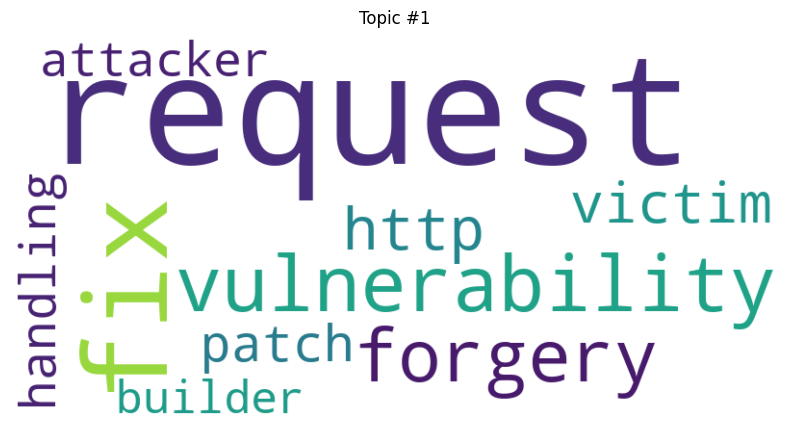
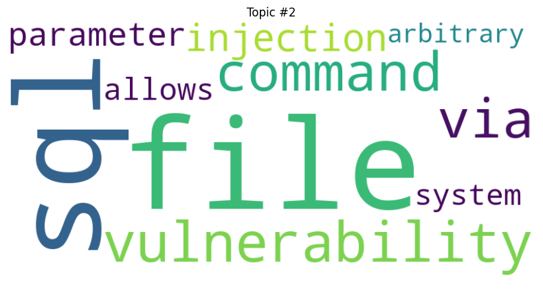

# AI-Based CVE Prioritization Using Threat Prediction

TL;DR: This project implements a comprehensive framework for CVE (Common Vulnerabilities and Exposures) prioritization, leveraging machine learning models to predict the likelihood of exploit publication and malware inclusion for each CVE. 
These predictions are combined into a threat score, which is used to rank and prioritize vulnerabilities to be implemented in Red Hat Advanced Cluster Security (RHACS).

## Introduction
There is a rapidly growing number of CVEs. 
This high volume of vulnerabilities makes it challenging to quickly identify and prioritize CVEs for remediation.
Nevertheless, current views may not always allow for identifying CVEs that are most likely to be exploited. 
Factors like severity score or discovery date may not always indicate the highest risk. 
Critical factors such as exploit publications or malware inclusion in known malware families may be better indicators of vulnerabilities with high-impact potential.
This approach presents an explainable AI framework to score CVEs based on their potential threat, allowing for more accurate prioritization. 
The explainability of this solution is key in enabling users to identify which features contribute most to the threat score, offering valuable insights.
This project is based on the paper [Threat Class Predictor: An explainable framework for predicting vulnerability threat using topic and trend modeling](https://ceur-ws.org/Vol-3391/paper8.pdf) (_Aghaei et al._), which presents an AI-based approach for predicting the risk of CVEs. 

## Data

Data was obtained from the CVE security vulnerability database.
It was cleaned and preprocessed to include only relevant features for the threat prediction models.
After the preprocessing phase, the dataset comprises 169,294 vulnerabilities spanning from 1999 to 2024.
The data includes CVSS Version 3 specifications.

Exploit publication labels were obtained from two sources: the ExploitDB and PacketStorm databases.
Malware inclusion labels were obtained from the ClamAV malware signature database.
Exploit publication and malware inclusion labels are separately assigned to each CVE, with a binary value indicating whether the CVE is publicly exploited or included in malware, respectively.

## Methodology

### Topic Model

The topic model is a key component of the threat prediction framework. By applying Latent Dirichlet Allocation (LDA), we capture latent topics within the vulnerability descriptions, which provide contextual information for each CVE.

- **Preprocessing**: Text descriptions are tokenized, lemmatized, and stripped of common words, stop words, and URLs to produce a clean corpus. This corpus is represented in the bag-of-words format.
- **Model Training**: The LDA model is trained on 169,294 vulnerability descriptions using **30 topics**, with **50 iterations** and **10 passes**. The output of this model is a 30-dimensional topic probability vector for each vulnerability, which is then used as input features in the prediction of the threat score.

The paper highlights the use of these topic vectors to encode semantic information from vulnerability descriptions and integrate them into the threat prediction models. Visualization of topics as word clouds helps to interpret the key themes present in each topic. Larger words in the word cloud are more likely to appear within that topic.

### Threat Models

The threat prediction task involves training two binary classification models to predict:
1. **Exploit Publication**: Whether a CVE will likely be publicly exploited.
2. **Malware Inclusion**: Whether a CVE will likely be included in malware.

We employ **Random Forest classifiers** for both tasks, leveraging various features from the dataset, including:

- **Description Length**: The length of the CVE’s textual description (numerical).
- **References**: The number of external references provided for the vulnerability (numerical).
- **Configurations Length**: The number of software configurations affected by the CVE (numerical).
- **CVSS Score**: The severity of the vulnerability based on the Common Vulnerability Scoring System V3 (numerical).
- **Access Vector**: Whether the vulnerability can be exploited locally or across a network (categorical: local/network).
- **Access Complexity**: The difficulty level required to exploit the vulnerability (categorical: low/medium/high).
- **Authentication**: Whether authentication is required to exploit the vulnerability (categorical: true/false).
- **Confidentiality Impact**: The potential impact on data confidentiality (categorical: none/partial/complete).
- **Integrity Impact**: The potential impact on data integrity (categorical: none/partial/complete).
- **Availability Impact**: The potential impact on system availability (categorical: none/partial/complete).
- **Topic Probabilities**: The 30-dimensional topic probability vector generated by the LDA model.

Each threat model outputs a probability score for each CVE. 
These scores are combined into a **Threat Score**, which is used to rank vulnerabilities based on their predicted risk.
The combined threat score is calculated by summing the prediction probabilities for **Exploit Publication** and **Malware Inclusion**, normalized to a 0-10 scale for ease of interpretation and prioritization. 
This threat score provides a comprehensive view of the potential risk associated with each CVE, enabling security teams to focus on vulnerabilities with the highest threat levels.

### Model Explainability

The explainability of the threat prediction models is crucial for understanding the factors contributing to the threat score.
By analyzing the feature importance of the Random Forest classifiers, we can identify which features have the most significant impact on the prediction of exploit publication and malware inclusion.
This information is valuable for security analysts and system administrators, as it provides insights into the key factors driving the risk associated with each CVE.

